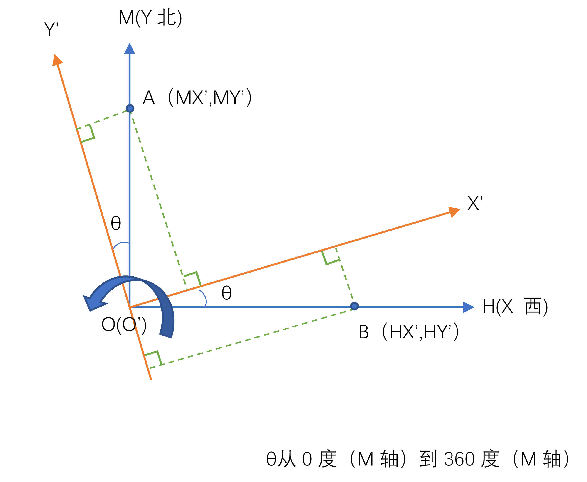
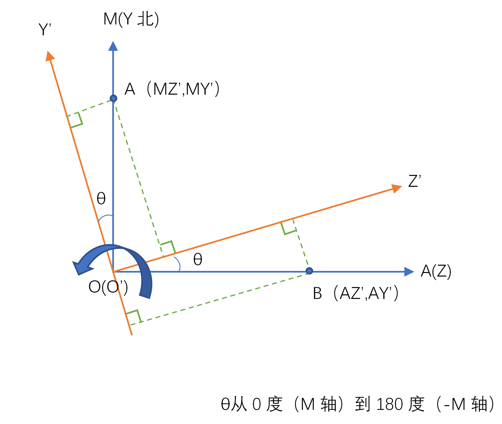
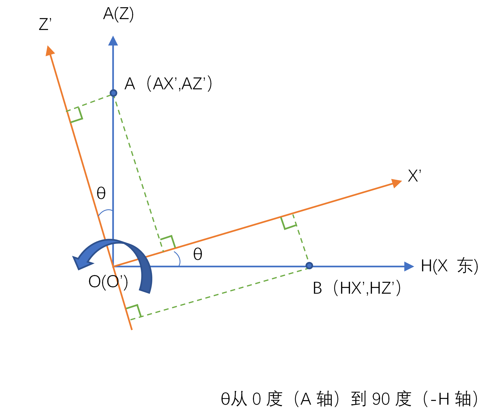

# Android SensorManger类部分源码解读

## 1.函数——getRotationMatrix

### 1.1源码

```java
/**
     * <p>
     * Computes the inclination matrix <b>I</b> as well as the rotation matrix
     * <b>R</b> transforming a vector from the device coordinate system to the
     * world's coordinate system which is defined as a direct orthonormal basis,
     * where:
     * </p>
     *
     * <ul>
     * <li>X is defined as the vector product <b>Y.Z</b> (It is tangential to
     * the ground at the device's current location and roughly points East).</li>
     * <li>Y is tangential to the ground at the device's current location and
     * points towards the magnetic North Pole.</li>
     * <li>Z points towards the sky and is perpendicular to the ground.</li>
     * </ul>
     *
     * <p>
     * <center></center>
     * </p>
     *
     * <p>
     * <hr>
     * <p>
     * By definition:
     * <p>
     * [0 0 g] = <b>R</b> * <b>gravity</b> (g = magnitude of gravity)
     * <p>
     * [0 m 0] = <b>I</b> * <b>R</b> * <b>geomagnetic</b> (m = magnitude of
     * geomagnetic field)
     * <p>
     * <b>R</b> is the identity matrix when the device is aligned with the
     * world's coordinate system, that is, when the device's X axis points
     * toward East, the Y axis points to the North Pole and the device is facing
     * the sky.
     *
     * <p>
     * <b>I</b> is a rotation matrix transforming the geomagnetic vector into
     * the same coordinate space as gravity (the world's coordinate space).
     * <b>I</b> is a simple rotation around the X axis. The inclination angle in
     * radians can be computed with {@link #getInclination}.
     * <hr>
     *
     * <p>
     * Each matrix is returned either as a 3x3 or 4x4 row-major matrix depending
     * on the length of the passed array:
     * <p>
     * <u>If the array length is 16:</u>
     *
     * <pre>
     *   /  M[ 0]   M[ 1]   M[ 2]   M[ 3]  \
     *   |  M[ 4]   M[ 5]   M[ 6]   M[ 7]  |
     *   |  M[ 8]   M[ 9]   M[10]   M[11]  |
     *   \  M[12]   M[13]   M[14]   M[15]  /
     *</pre>
     *
     * This matrix is ready to be used by OpenGL ES's
     * {@link javax.microedition.khronos.opengles.GL10#glLoadMatrixf(float[], int)
     * glLoadMatrixf(float[], int)}.
     * <p>
     * Note that because OpenGL matrices are column-major matrices you must
     * transpose the matrix before using it. However, since the matrix is a
     * rotation matrix, its transpose is also its inverse, conveniently, it is
     * often the inverse of the rotation that is needed for rendering; it can
     * therefore be used with OpenGL ES directly.
     * <p>
     * Also note that the returned matrices always have this form:
     *
     * <pre>
     *   /  M[ 0]   M[ 1]   M[ 2]   0  \
     *   |  M[ 4]   M[ 5]   M[ 6]   0  |
     *   |  M[ 8]   M[ 9]   M[10]   0  |
     *   \      0       0       0   1  /
     *</pre>
     *
     * <p>
     * <u>If the array length is 9:</u>
     *
     * <pre>
     *   /  M[ 0]   M[ 1]   M[ 2]  \
     *   |  M[ 3]   M[ 4]   M[ 5]  |
     *   \  M[ 6]   M[ 7]   M[ 8]  /
     *</pre>
     *
     * <hr>
     * <p>
     * The inverse of each matrix can be computed easily by taking its
     * transpose.
     *
     * <p>
     * The matrices returned by this function are meaningful only when the
     * device is not free-falling and it is not close to the magnetic north. If
     * the device is accelerating, or placed into a strong magnetic field, the
     * returned matrices may be inaccurate.
     *
     * @param R
     *        is an array of 9 floats holding the rotation matrix <b>R</b> when
     *        this function returns. R can be null.
     *        <p>
     *
     * @param I
     *        is an array of 9 floats holding the rotation matrix <b>I</b> when
     *        this function returns. I can be null.
     *        <p>
     *
     * @param gravity
     *        is an array of 3 floats containing the gravity vector expressed in
     *        the device's coordinate. You can simply use the
     *        {@link android.hardware.SensorEvent#values values} returned by a
     *        {@link android.hardware.SensorEvent SensorEvent} of a
     *        {@link android.hardware.Sensor Sensor} of type
     *        {@link android.hardware.Sensor#TYPE_ACCELEROMETER
     *        TYPE_ACCELEROMETER}.
     *        <p>
     *
     * @param geomagnetic
     *        is an array of 3 floats containing the geomagnetic vector
     *        expressed in the device's coordinate. You can simply use the
     *        {@link android.hardware.SensorEvent#values values} returned by a
     *        {@link android.hardware.SensorEvent SensorEvent} of a
     *        {@link android.hardware.Sensor Sensor} of type
     *        {@link android.hardware.Sensor#TYPE_MAGNETIC_FIELD
     *        TYPE_MAGNETIC_FIELD}.
     *
     * @return <code>true</code> on success, <code>false</code> on failure (for
     *         instance, if the device is in free fall). Free fall is defined as
     *         condition when the magnitude of the gravity is less than 1/10 of
     *         the nominal value. On failure the output matrices are not modified.
     *
     * @see #getInclination(float[])
     * @see #getOrientation(float[], float[])
     * @see #remapCoordinateSystem(float[], int, int, float[])
     */

    public static boolean getRotationMatrix(float[] R, float[] I,
            float[] gravity, float[] geomagnetic) {
        // TODO: move this to native code for efficiency
        float Ax = gravity[0];
        float Ay = gravity[1];
        float Az = gravity[2];
        // normsqA是向量点乘。
        final float normsqA = (Ax * Ax + Ay * Ay + Az * Az);
        final float g = 9.81f;
        final float freeFallGravitySquared = 0.01f * g * g;
        if (normsqA < freeFallGravitySquared) {
            // gravity less than 10% of normal value
            return false;
        }

        final float Ex = geomagnetic[0];
        final float Ey = geomagnetic[1];
        final float Ez = geomagnetic[2];
        float Hx = Ey * Az - Ez * Ay;
        float Hy = Ez * Ax - Ex * Az;
        float Hz = Ex * Ay - Ey * Ax;
        final float normH = (float) Math.sqrt(Hx * Hx + Hy * Hy + Hz * Hz);

        if (normH < 0.1f) {
            // device is close to free fall (or in space?), or close to
            // magnetic north pole. Typical values are  > 100.
            return false;
        }
        final float invH = 1.0f / normH;
        Hx *= invH;
        Hy *= invH;
        Hz *= invH;
        final float invA = 1.0f / (float) Math.sqrt(Ax * Ax + Ay * Ay + Az * Az);
        Ax *= invA;
        Ay *= invA;
        Az *= invA;
        final float Mx = Ay * Hz - Az * Hy;
        final float My = Az * Hx - Ax * Hz;
        final float Mz = Ax * Hy - Ay * Hx;
        if (R != null) {
            if (R.length == 9) {
                R[0] = Hx;     R[1] = Hy;     R[2] = Hz;
                R[3] = Mx;     R[4] = My;     R[5] = Mz;
                R[6] = Ax;     R[7] = Ay;     R[8] = Az;
            } else if (R.length == 16) {
                R[0]  = Hx;    R[1]  = Hy;    R[2]  = Hz;   R[3]  = 0;
                R[4]  = Mx;    R[5]  = My;    R[6]  = Mz;   R[7]  = 0;
                R[8]  = Ax;    R[9]  = Ay;    R[10] = Az;   R[11] = 0;
                R[12] = 0;     R[13] = 0;     R[14] = 0;    R[15] = 1;
            }
        }
        if (I != null) {
            // compute the inclination matrix by projecting the geomagnetic
            // vector onto the Z (gravity) and X (horizontal component
            // of geomagnetic vector) axes.
            final float invE = 1.0f / (float) Math.sqrt(Ex * Ex + Ey * Ey + Ez * Ez);
            final float c = (Ex * Mx + Ey * My + Ez * Mz) * invE;
            final float s = (Ex * Ax + Ey * Ay + Ez * Az) * invE;
            if (I.length == 9) {
                I[0] = 1;     I[1] = 0;     I[2] = 0;
                I[3] = 0;     I[4] = c;     I[5] = s;
                I[6] = 0;     I[7] = -s;     I[8] = c;
            } else if (I.length == 16) {
                I[0] = 1;     I[1] = 0;     I[2] = 0;
                I[4] = 0;     I[5] = c;     I[6] = s;
                I[8] = 0;     I[9] = -s;     I[10] = c;
                I[3] = I[7] = I[11] = I[12] = I[13] = I[14] = 0;
                I[15] = 1;
            }
        }
        return true;
    }
```

### 1.2原理

#### 1.2.1传感器坐标系

​	通常，传感器框架使用标准的 3 轴坐标系来表示数据值。对于大多数传感器，当设备处于**自然屏幕方向**时，会相对于设备屏幕来定义坐标系（参见图 1）。当设备处于**自然屏幕方向**时，X 轴为水平向右延伸，Y 轴为垂直向上延伸，Z 轴为垂直于屏幕向外延伸。在此坐标系中，屏幕后面的坐标将具有负 Z 值。以下传感器使用此坐标系：**加速度传感器**、**重力传感器**、**陀螺仪**、**线性加速度传感器**、**地磁场传感器**。


<center>图1 Sensor API 使用的坐标系（相对于设备）</center>

注1：在图形学中，这种坐标系叫做**物体坐标系**。物体坐标与物体绑定，不会因为物体在**世界坐标系**中状态的改变而改变。**世界坐标系**可以简单理解为可以描述其他所有坐标系或者物体的位置的最大坐标系。而安卓中的**世界坐标系**，经过验证，可以确定为：X轴正向为正北，Y轴正向为正东，Z轴正向指向天空（与重力方向相反）。

注2：设备的**自然屏幕方向**不一定总是竖屏。通常情况下平板设备一般为横屏，而传感器坐标系始终基于**自然屏幕方向**。

注3：图1来自谷歌开发文档，侵删。

注4：Typora可正常查看下文的LaTeX数学公式，Github上查看数学公式需要安装谷歌浏览器插件——[MathJax Plugin for Github - Chrome 网上应用店 (google.com)](https://chrome.google.com/webstore/detail/mathjax-plugin-for-github/ioemnmodlmafdkllaclgeombjnmnbima)

#### 1.2.2坐标基本变换（二维）

##### 1.2.2.1二维平移

​	将平移距离Tx和Ty加到原始坐标(x,y)上获得一个新的坐标位置(x',y')，可以实现一个二维位置的平移，写成矩阵形式为：
$$
\begin{bmatrix}
x' \\\\ y'
\end{bmatrix}
=
\begin{bmatrix}
x \\\\ y
\end{bmatrix}
+
\begin{bmatrix}
t_x \\\\ t_y
\end{bmatrix}
$$
**1.2.2.2二维旋转**

​	在极坐标系中，r是点到原点的固定距离，角度φ是点(x,y)的原始角度位置与水平线的夹角，θ是旋转角（**逆时针为正**），则旋转后的坐标(x',y')可以表示为：
$$
\begin{cases}
x'= r (cos \theta + \phi ) = r cos \phi cos \theta - r sin \phi sin \theta  \\\\
y'= r (sin \theta + \phi ) = r cos \phi sin \theta + r sin \phi cos \theta
\end{cases}
$$
​	在极坐标系中，点的原始坐标为：
$$
x = r cos \theta ,  y = r sin \theta
$$
​	代入得：
$$
\begin{cases}
x' = x cos \theta - y sin \theta  \\\\
y' = x sin \theta + y cos \theta
\end{cases}
$$
​	旋转矩阵R为：
$$
R ( \theta ) =
\begin{bmatrix}
cos \theta & - sin \theta \\\\ 
sin \theta & cos \theta
\end{bmatrix}
$$

​	写出矩阵形式为：
$$
\begin{bmatrix}
x' \\\\ y'
\end{bmatrix}=
R \cdot
\begin{bmatrix}
x \\\\ y
\end{bmatrix}
$$

##### 1.2.2.3二维缩放

​	改变一个对象的大小，可以使用缩放变化。一个简单的二维缩放操作可以通过将缩放系数Sx和Sy与对象坐标位置(x,y)相乘而得，写成矩阵形式为：
$$
\begin{bmatrix}
x' \\\\ y'
\end{bmatrix}=
\begin{bmatrix}
s_x  & 0 \\\\
0 & s_y 
\end{bmatrix}
\begin{bmatrix}
x \\\\ y
\end{bmatrix}
$$
当Sx和Sy相同时，就会产生保持对象相对比例的**一致缩放**，不同时就叫**差值缩放**。

#### 1.2.3齐次坐标

​	许多图形应用涉及到几何变化的顺序，在**1.2.2**节中我们已经看到，每个基本变换（平移、旋转和缩放）都可以表示为普通矩阵形式：
$$
P' = M_1 \cdot P + M_2
$$
坐标位置P’和P表示为列向量，矩阵M1是一个包含乘法系数的2×2矩阵，M2是包含平移项的两元素列矩阵。对于平移，M1是单位矩阵。对于旋转或缩放，M2包含与基准点或缩放固定点相关的平移项。为了利用这个公式产生先缩放、再旋转、后平移这样的变化顺序，必须一步一步地计算变换的坐标。而实际上，更有效的做法应该是将变换组合，从而直接从初始坐标得到最后的坐标位置，这样就消除了中间坐标值的计算。因此，需要重组等式以消除M2中与平移项相关的矩阵加法。

​	如果将2×2矩阵表达式扩充为3×3矩阵，就可以把二维几何变化的乘法和平移项组合成单一矩阵表示。这时将变换矩阵的第三列用于平移项，而所有的变换公式可表达为矩阵乘法。但为了这样操作，必须解释二维坐标位置到三元列向量的矩阵表示。标准的实现技术是将二维坐标(X,Y)扩充到三维表示(Xh,Yh,h)，称为**齐次坐标**。这里的**齐次参数**h是一个非零值，因此
$$
x = \frac {x_h} {h} , y = \frac {y_h} {h}
$$
​	这样，普通的二维齐次坐标表示可写为(h·x,h·y,h)。对于二维几何变换，可以把齐次参数h取为任何非零值。因而，对于每个坐标点(x,y)，可以有无数个等价的齐次表达式。最方便的选择是简单地设置为h=1。因此每个二维位置都可以用齐次坐标(x,y,1)来表示。h的其他值也是需要的，例如在三维观察变换的矩阵公式中。

​	**源码中之所以出现4×4的三维旋转矩阵，用的就是齐次坐标这一概念。**

#### 1.2.4坐标系间的变换（三维旋转）

​	我们可以围绕空间的任意轴旋转一个对象，但绕平行于坐标轴的轴的旋转是最容易处理的。我们同样可以利用围绕坐标轴旋转（结合适当的平移）的复合结果来表示任意一种旋转。因此，我们先考虑坐标轴的旋转操作，然后讨论其他旋转轴所需的计算。

​	为了方便理解，我们首先从二维旋转矩阵开始。如图2，同样的一个点，虽然位置不变，但是在旋转前和旋转后的坐标系中，坐标是不一样的。设旋转前为(x,y)，旋转后为(x',y')。


<center>图2 二维旋转坐标系示意图 </center>

​	由**1.2.2.2**中公式可以得到，旋转矩阵R为：
$$
R ( - \theta ) =
\begin{bmatrix}
cos \theta &  sin \theta \\\\ 
- sin \theta & cos \theta
\end{bmatrix}
$$
​	因为逆时针旋转坐标系相当于顺时针旋转点，所以θ相反。至此，我们可以将2D平面的旋转问题提升到3D空间的旋转问题，即分别绕三个轴作类似2D的旋转变换。需要额外注意的两个的问题是：

①通常，如果沿着坐标轴的正半轴观察原点，那么绕坐标轴的逆时针旋转为正向旋转；

②空间坐标系的旋转关系(复合结果)与各坐标轴的旋转顺序相关。

​	绕Z轴的二维坐标系旋转很容易推广到三维：
$$
z轴旋转
\begin{cases}
x' = x cos \theta + y sin \theta  \\\\
y' = x sin \theta - y cos \theta \\\\
z' = z
\end{cases}
$$


​	同理，绕X轴和绕Y轴的对应坐标关系如下，可由上式用X->Y->Z->X顺序循环替换（将X替换为Y，将Y替换为Z，将Z替换为X）得到：
$$
x轴旋转
\begin{cases}
y' = y cos \theta + z sin \theta  \\\\
z' = y sin \theta - z cos \theta \\\\
x' = x
\end{cases}
$$

$$
y轴旋转
\begin{cases}
z' = z cos \theta + x sin \theta  \\\\
x' = z sin \theta - x cos \theta \\\\
y' = y
\end{cases}
$$

​	我们假设坐标系O-XYZ依次绕自身X轴、Y轴、Z轴分别逆时针转θ1，θ2，θ3后可以与坐标系O'-X'Y'Z'重合，则空间中某点M在这两个坐标系中的描述关系如下：
$$
\begin{bmatrix}
x' \\\\ y' \\\\ z'
\end{bmatrix}=
\begin{bmatrix}
cos \theta_3 & sin \theta_3 & 0 \\\\
-sin \theta_3 & cos \theta_3 & 0 \\\\
0 & 0 & 1
\end{bmatrix}
\begin{bmatrix}
cos \theta_2 & 0 & -sin \theta_2 \\\\
0 & 1 & 0 \\\\
sin \theta_2 & 0 & cos \theta_2 
\end{bmatrix}
\begin{bmatrix}
1 & 0 & 0 \\\\
0 & cos \theta_1 & sin \theta_1 \\\\
0 & -sin \theta_1 & cos \theta_1 
\end{bmatrix}
\begin{bmatrix}
x \\\\ y \\\\ z
\end{bmatrix}
$$

### 1.3代码解释	

​	三维空间中只需要3个基向量即可表示空间中所有的向量，想要获得的3*3旋转矩阵**R**实际上是一组规范正交基。也就是说，我们希望通过地磁和重力获得这样一个**R**矩阵，当设备满足以下条件：

​			①设备屏幕所在的平面和地面所在的平面平行；

​			②设备的**自然屏幕方向**（Y轴正向）与地磁方向（正北）相同；

​			③设备屏幕朝向天空（此时Z轴正向与重力方向相反）；

此时的设备（**物体坐标系**）与**世界坐标系**对齐，**R**为单位矩阵。

​	**I**矩阵也是一个旋转矩阵，它的作用是将地磁向量转换到与重力（世界坐标空间）相同的坐标空间。**I**只是一个绕X轴的旋转矩阵，它也可以使用下面这个函数获得。

```java
getInclination(float[])
```

​	虽然利用重力和地磁可以唯一确定一个世界坐标系，但是重力方向和地磁方向却不一定是垂直的。为了获得一组规范正交基（世界坐标系），还需要再进行一次叉乘计算。具体过程如下：

​			①通过**向量E（地磁向量）**和**向量A（与重力向量大小相等，方向相反）**的叉乘（**E×A**）确定东西方向的**向量H**。**向量H**指向正东，且由叉乘的性质可知，该向量一定与**重力向量A**和**地磁向量E**垂直。

​			②将**向量H**和**向量A**规范化。

​			③**向量A**与**向量H**的叉乘（**A×H**）可以得到南北方向的**向量M**。**向量M**指向正北，且一定与**向量A**和**向量H**垂直，此时便得到了由向量H、向量M和向量A组成的一组规范正交基。

​			④矩阵R就是由向量H、向量M和向量A组成的。
$$
R=[H,M,A] ^\mathsf{T}
$$
​	矩阵**I**的计算步骤也是非常好理解的，它的目的就是获得从物体坐标系到世界坐标系的一个简单旋转矩阵。设坐标系原点为O，由于地磁向量在MOA（YOZ）平面，所以该旋转矩阵就是绕H（X）轴的一个旋转矩阵。具体公式在**1.2.2**中介绍过了，就不再赘述了。

## 2.函数——getOrientation

### 2.1源码

```java
 /**
     * Computes the device's orientation based on the rotation matrix.
     * <p>
     * When it returns, the array values are as follows:
     * <ul>
     * <li>values[0]: <i>Azimuth</i>, angle of rotation about the -z axis.
     *                This value represents the angle between the device's y
     *                axis and the magnetic north pole. When facing north, this
     *                angle is 0, when facing south, this angle is &pi;.
     *                Likewise, when facing east, this angle is &pi;/2, and
     *                when facing west, this angle is -&pi;/2. The range of
     *                values is -&pi; to &pi;.</li>
     * <li>values[1]: <i>Pitch</i>, angle of rotation about the x axis.
     *                This value represents the angle between a plane parallel
     *                to the device's screen and a plane parallel to the ground.
     *                Assuming that the bottom edge of the device faces the
     *                user and that the screen is face-up, tilting the top edge
     *                of the device toward the ground creates a positive pitch
     *                angle. The range of values is -&pi; to &pi;.</li>
     * <li>values[2]: <i>Roll</i>, angle of rotation about the y axis. This
     *                value represents the angle between a plane perpendicular
     *                to the device's screen and a plane perpendicular to the
     *                ground. Assuming that the bottom edge of the device faces
     *                the user and that the screen is face-up, tilting the left
     *                edge of the device toward the ground creates a positive
     *                roll angle. The range of values is -&pi;/2 to &pi;/2.</li>
     * </ul>
     * <p>
     * Applying these three rotations in the azimuth, pitch, roll order
     * transforms an identity matrix to the rotation matrix passed into this
     * method. Also, note that all three orientation angles are expressed in
     * <b>radians</b>.
     *
     * @param R
     *        rotation matrix see {@link #getRotationMatrix}.
     *
     * @param values
     *        an array of 3 floats to hold the result.
     *
     * @return The array values passed as argument.
     *
     * @see #getRotationMatrix(float[], float[], float[], float[])
     * @see GeomagneticField
     */
    public static float[] getOrientation(float[] R, float[] values) {
        /*
         * 4x4 (length=16) case:
         *   /  R[ 0]   R[ 1]   R[ 2]   0  \
         *   |  R[ 4]   R[ 5]   R[ 6]   0  |
         *   |  R[ 8]   R[ 9]   R[10]   0  |
         *   \      0       0       0   1  /
         *
         * 3x3 (length=9) case:
         *   /  R[ 0]   R[ 1]   R[ 2]  \
         *   |  R[ 3]   R[ 4]   R[ 5]  |
         *   \  R[ 6]   R[ 7]   R[ 8]  /
         *
         */
        if (R.length == 9) {
            values[0] = (float) Math.atan2(R[1], R[4]);
            values[1] = (float) Math.asin(-R[7]);
            values[2] = (float) Math.atan2(-R[6], R[8]);
        } else {
            values[0] = (float) Math.atan2(R[1], R[5]);
            values[1] = (float) Math.asin(-R[9]);
            values[2] = (float) Math.atan2(-R[8], R[10]);
        }

        return values;
    }
```

### 2.2原理

- **方位角（绕 Z轴旋转的角度）。**此为设备当前指南针方向与磁北向之间的角度。如果设备的上边缘面朝磁北向，则方位角为 0 度；如果上边缘朝南，则方位角为 180 度。与之类似，如果上边缘朝东，则方位角为 90 度；如果上边缘朝西，则方位角为 270 度。

  **详细解释：**绕Z轴就只需要考虑XOY平面，如图3中的θ就是所求的方位角。这里需要解释说明的是，R矩阵是用物体坐标系来表示的，因此我们能获得的R矩阵实际上是用旋转后的物体坐标系表示的。换句话说，图3中的A点，我们只能获得(MX’,MY')，而不能获得(MX,MY)。代码中求方位角用的是Math.atan2（HY‘，MY’），实际上就是反三角函数arctan。乍一看有点懵逼，为什么可以用两个不同点的Y坐标呢？实际上这跟旋转矩阵有关，公式如下所示，将这个公式与代码进行比对就一目了然了。
  $$
  R=
  \begin{bmatrix}
  cos \phi cos \psi - sin \phi sin \psi sin \theta 
  & sin \phi cos \theta 
  & cos \phi sin \psi + sin \phi cos \psi sin \theta 
  \\\\
  - sin \phi cos \psi - cos \phi sin \psi sin \theta 
  & cos \phi cos \theta 
  & - sin \phi sin \psi + cos \phi cos \psi sin \theta 
  \\\\
  - sin \psi cos \theta
  & - sin \theta 
  &  cos \psi cos \theta 
  \end{bmatrix}
  $$
  
  
  
  <center>图3 方位角示意图</center>																
  
  注：为了画图、解释更方便，这里将向量直接用点来代替表示了，图4、图5同理。
  
- **俯仰角（绕 X轴旋转的角度）。**此为平行于设备屏幕的平面与平行于地面的平面之间的角度。如果将设备与地面平行放置，且其下边缘最靠近您，同时将设备上边缘向地面倾斜，则俯仰角将变为正值。沿相反方向倾斜（将设备上边缘向远离地面的方向移动）将使俯仰角变为负值。值的范围为 -180 度到 180 度。

- **详细解释：**绕X轴就只需要考虑XOY平面，如图4中的θ就是所求的俯仰角。原理同**方向角**。

  

  <center>图4 俯仰角示意图</center>																										

  Math.asin就是arcsin反三角函数。

- **倾侧角（绕 Y 轴旋转的角度）。**此为垂直于设备屏幕的平面与垂直于地面的平面之间的角度。如果将设备与地面平行放置，且其下边缘最靠近您，同时将设备左边缘向地面倾斜，则侧倾角将变为正值。沿相反方向倾斜（将设备右边缘移向地面）将使侧倾角变为负值。值的范围为 -90 度到 90 度。

  **详细解释：**绕X轴就只需要考虑XOZ平面，如图5中的θ就是所求的倾侧角。原理同**方向角**。

  

  <center>图5 倾侧角示意图</center>		

### 2.3代码解释

​	getOrientation函数的代码比较简单，没有什么复杂的逻辑，详细的原理已经在**2.2**中解释清楚了，这里只解释一下Math.atan2函数的使用，atan2的具体公式如图6。


​																							图6 atan2公式

