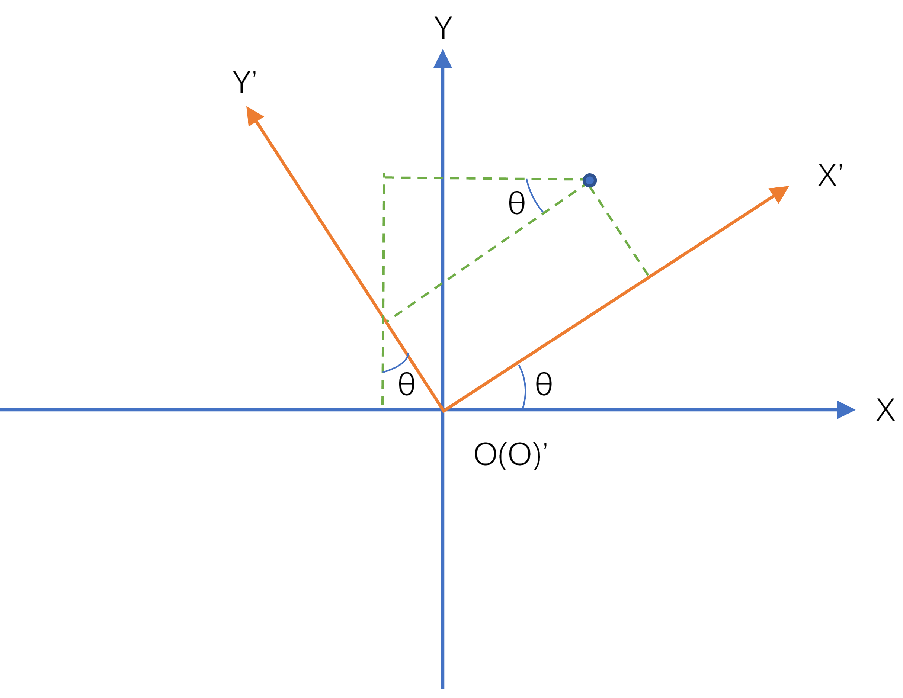

# Android SensorManger类部分源码解读

## 1.函数——getRotationMatrix

### 1.1源码

```java
/**
     * <p>
     * Computes the inclination matrix <b>I</b> as well as the rotation matrix
     * <b>R</b> transforming a vector from the device coordinate system to the
     * world's coordinate system which is defined as a direct orthonormal basis,
     * where:
     * </p>
     *
     * <ul>
     * <li>X is defined as the vector product <b>Y.Z</b> (It is tangential to
     * the ground at the device's current location and roughly points East).</li>
     * <li>Y is tangential to the ground at the device's current location and
     * points towards the magnetic North Pole.</li>
     * <li>Z points towards the sky and is perpendicular to the ground.</li>
     * </ul>
     *
     * <p>
     * <center></center>
     * </p>
     *
     * <p>
     * <hr>
     * <p>
     * By definition:
     * <p>
     * [0 0 g] = <b>R</b> * <b>gravity</b> (g = magnitude of gravity)
     * <p>
     * [0 m 0] = <b>I</b> * <b>R</b> * <b>geomagnetic</b> (m = magnitude of
     * geomagnetic field)
     * <p>
     * <b>R</b> is the identity matrix when the device is aligned with the
     * world's coordinate system, that is, when the device's X axis points
     * toward East, the Y axis points to the North Pole and the device is facing
     * the sky.
     *
     * <p>
     * <b>I</b> is a rotation matrix transforming the geomagnetic vector into
     * the same coordinate space as gravity (the world's coordinate space).
     * <b>I</b> is a simple rotation around the X axis. The inclination angle in
     * radians can be computed with {@link #getInclination}.
     * <hr>
     *
     * <p>
     * Each matrix is returned either as a 3x3 or 4x4 row-major matrix depending
     * on the length of the passed array:
     * <p>
     * <u>If the array length is 16:</u>
     *
     * <pre>
     *   /  M[ 0]   M[ 1]   M[ 2]   M[ 3]  \
     *   |  M[ 4]   M[ 5]   M[ 6]   M[ 7]  |
     *   |  M[ 8]   M[ 9]   M[10]   M[11]  |
     *   \  M[12]   M[13]   M[14]   M[15]  /
     *</pre>
     *
     * This matrix is ready to be used by OpenGL ES's
     * {@link javax.microedition.khronos.opengles.GL10#glLoadMatrixf(float[], int)
     * glLoadMatrixf(float[], int)}.
     * <p>
     * Note that because OpenGL matrices are column-major matrices you must
     * transpose the matrix before using it. However, since the matrix is a
     * rotation matrix, its transpose is also its inverse, conveniently, it is
     * often the inverse of the rotation that is needed for rendering; it can
     * therefore be used with OpenGL ES directly.
     * <p>
     * Also note that the returned matrices always have this form:
     *
     * <pre>
     *   /  M[ 0]   M[ 1]   M[ 2]   0  \
     *   |  M[ 4]   M[ 5]   M[ 6]   0  |
     *   |  M[ 8]   M[ 9]   M[10]   0  |
     *   \      0       0       0   1  /
     *</pre>
     *
     * <p>
     * <u>If the array length is 9:</u>
     *
     * <pre>
     *   /  M[ 0]   M[ 1]   M[ 2]  \
     *   |  M[ 3]   M[ 4]   M[ 5]  |
     *   \  M[ 6]   M[ 7]   M[ 8]  /
     *</pre>
     *
     * <hr>
     * <p>
     * The inverse of each matrix can be computed easily by taking its
     * transpose.
     *
     * <p>
     * The matrices returned by this function are meaningful only when the
     * device is not free-falling and it is not close to the magnetic north. If
     * the device is accelerating, or placed into a strong magnetic field, the
     * returned matrices may be inaccurate.
     *
     * @param R
     *        is an array of 9 floats holding the rotation matrix <b>R</b> when
     *        this function returns. R can be null.
     *        <p>
     *
     * @param I
     *        is an array of 9 floats holding the rotation matrix <b>I</b> when
     *        this function returns. I can be null.
     *        <p>
     *
     * @param gravity
     *        is an array of 3 floats containing the gravity vector expressed in
     *        the device's coordinate. You can simply use the
     *        {@link android.hardware.SensorEvent#values values} returned by a
     *        {@link android.hardware.SensorEvent SensorEvent} of a
     *        {@link android.hardware.Sensor Sensor} of type
     *        {@link android.hardware.Sensor#TYPE_ACCELEROMETER
     *        TYPE_ACCELEROMETER}.
     *        <p>
     *
     * @param geomagnetic
     *        is an array of 3 floats containing the geomagnetic vector
     *        expressed in the device's coordinate. You can simply use the
     *        {@link android.hardware.SensorEvent#values values} returned by a
     *        {@link android.hardware.SensorEvent SensorEvent} of a
     *        {@link android.hardware.Sensor Sensor} of type
     *        {@link android.hardware.Sensor#TYPE_MAGNETIC_FIELD
     *        TYPE_MAGNETIC_FIELD}.
     *
     * @return <code>true</code> on success, <code>false</code> on failure (for
     *         instance, if the device is in free fall). Free fall is defined as
     *         condition when the magnitude of the gravity is less than 1/10 of
     *         the nominal value. On failure the output matrices are not modified.
     *
     * @see #getInclination(float[])
     * @see #getOrientation(float[], float[])
     * @see #remapCoordinateSystem(float[], int, int, float[])
     */

    public static boolean getRotationMatrix(float[] R, float[] I,
            float[] gravity, float[] geomagnetic) {
        // TODO: move this to native code for efficiency
        float Ax = gravity[0];
        float Ay = gravity[1];
        float Az = gravity[2];
		// normsqA是向量点乘。
        final float normsqA = (Ax * Ax + Ay * Ay + Az * Az);
        final float g = 9.81f;
        final float freeFallGravitySquared = 0.01f * g * g;
        if (normsqA < freeFallGravitySquared) {
            // gravity less than 10% of normal value
            return false;
        }

        final float Ex = geomagnetic[0];
        final float Ey = geomagnetic[1];
        final float Ez = geomagnetic[2];
        float Hx = Ey * Az - Ez * Ay;
        float Hy = Ez * Ax - Ex * Az;
        float Hz = Ex * Ay - Ey * Ax;
        final float normH = (float) Math.sqrt(Hx * Hx + Hy * Hy + Hz * Hz);

        if (normH < 0.1f) {
            // device is close to free fall (or in space?), or close to
            // magnetic north pole. Typical values are  > 100.
            return false;
        }
        final float invH = 1.0f / normH;
        Hx *= invH;
        Hy *= invH;
        Hz *= invH;
        final float invA = 1.0f / (float) Math.sqrt(Ax * Ax + Ay * Ay + Az * Az);
        Ax *= invA;
        Ay *= invA;
        Az *= invA;
        final float Mx = Ay * Hz - Az * Hy;
        final float My = Az * Hx - Ax * Hz;
        final float Mz = Ax * Hy - Ay * Hx;
        if (R != null) {
            if (R.length == 9) {
                R[0] = Hx;     R[1] = Hy;     R[2] = Hz;
                R[3] = Mx;     R[4] = My;     R[5] = Mz;
                R[6] = Ax;     R[7] = Ay;     R[8] = Az;
            } else if (R.length == 16) {
                R[0]  = Hx;    R[1]  = Hy;    R[2]  = Hz;   R[3]  = 0;
                R[4]  = Mx;    R[5]  = My;    R[6]  = Mz;   R[7]  = 0;
                R[8]  = Ax;    R[9]  = Ay;    R[10] = Az;   R[11] = 0;
                R[12] = 0;     R[13] = 0;     R[14] = 0;    R[15] = 1;
            }
        }
        if (I != null) {
            // compute the inclination matrix by projecting the geomagnetic
            // vector onto the Z (gravity) and X (horizontal component
            // of geomagnetic vector) axes.
            final float invE = 1.0f / (float) Math.sqrt(Ex * Ex + Ey * Ey + Ez * Ez);
            final float c = (Ex * Mx + Ey * My + Ez * Mz) * invE;
            final float s = (Ex * Ax + Ey * Ay + Ez * Az) * invE;
            if (I.length == 9) {
                I[0] = 1;     I[1] = 0;     I[2] = 0;
                I[3] = 0;     I[4] = c;     I[5] = s;
                I[6] = 0;     I[7] = -s;     I[8] = c;
            } else if (I.length == 16) {
                I[0] = 1;     I[1] = 0;     I[2] = 0;
                I[4] = 0;     I[5] = c;     I[6] = s;
                I[8] = 0;     I[9] = -s;     I[10] = c;
                I[3] = I[7] = I[11] = I[12] = I[13] = I[14] = 0;
                I[15] = 1;
            }
        }
        return true;
    }
```

### 1.2原理

#### 1.2.1传感器坐标系

​	通常，传感器框架使用标准的 3 轴坐标系来表示数据值。对于大多数传感器，当设备处于**自然屏幕方向**时，会相对于设备屏幕来定义坐标系（参见图 1）。当设备处于默认屏幕方向时，X 轴为水平向右延伸，Y 轴为垂直向上延伸，Z 轴为垂直于屏幕向外延伸。在此坐标系中，屏幕后面的坐标将具有负 Z 值。以下传感器使用此坐标系：**加速度传感器**、**重力传感器**、**陀螺仪**、**线性加速度传感器**、**地磁场传感器**。

 

图1 Sensor API 使用的坐标系（相对于设备）

注1：在图形学中，这种坐标系叫做**物体坐标系**。物体坐标与物体绑定，不会因为物体在**世界坐标系**中状态的改变而改变。**世界坐标系**可以简单理解为可以描述其他所有坐标系或者物体的位置的最大坐标系。

注2：设备的**自然屏幕方向**不一定总是竖屏。通常情况下平板设备一般为横屏，而传感器坐标系始终基于**自然屏幕方向**。

注3：图片来自谷歌开发文档，侵删。

#### 1.2.2旋转矩阵

为了方便理解旋转矩阵的概念，我们首先从二维旋转矩阵开始。如图2，同样的一个点，虽然位置不变，但是在旋转前和旋转后的坐标系中，坐标是不一样的。设旋转前为(X,Y)，旋转后为(X',Y')。



​																							图2 二维旋转坐标系示意图
$$
{\mbox{坐标之间的关系}}
\begin{cases}
X=X' \cdot cos \theta - Y'\cdot sin \theta \\\\
Y=X' \cdot sin \theta + Y'\cdot cos \theta \\\\
\end{cases}
$$

$$
\begin{bmatrix}
X \\ Y
\end{bmatrix}=
\begin{bmatrix}
cos \theta & -sin \theta \\
sin \theta & cos \theta \\
\end{bmatrix}
\begin{bmatrix}
X' \\ Y'
\end{bmatrix}
{\mbox{或者}}
\begin{bmatrix}
X' \\ Y'
\end{bmatrix}=
\begin{bmatrix}
cos \theta & sin \theta \\
-sin \theta & cos \theta \\
\end{bmatrix}
\begin{bmatrix}
X \\ Y
\end{bmatrix}
$$

​	上面的公式就是2D平民的旋转矩阵的由来。至此，我们可以将2D平面的旋转问题提升到3D空间的旋转问题，即分别绕三个轴作类似2D的旋转变换。需要额外注意的两个的问题是：

①当绕某根轴旋转时，其他两轴建立的2D坐标系应该保证旋转轴的正方向垂直纸面向外（与旋转角正方向定义相关）；

②空间坐标系的旋转关系与各坐标轴的旋转顺序相关。

​	假设两个空间坐标系O-XYZ与O'-X'Y'Z'之间只存在一个坐标轴的旋转，若坐标系O-XYZ绕自身的X轴逆时针转theta之后与坐标系O’-X'Y'Z'重合，空间中某点M在坐标系O-XYZ和O'-X'Y'Z'中的坐标描述存在以下关系：
$$
\begin{bmatrix}
X' \\ Y' \\ Z'
\end{bmatrix}=
\begin{bmatrix}
1 & 0 & 0 \\
0 & cos \theta & sin \theta \\
0 & -sin \theta & cos \theta \\
\end{bmatrix}
\begin{bmatrix}
X \\ Y \\ Z
\end{bmatrix}
{\mbox{(绕X轴)}}
$$
同理，绕Y轴和绕Z轴的对应坐标关系如下：
$$
\begin{bmatrix}
X' \\ Y' \\ Z'
\end{bmatrix}=
\begin{bmatrix}
cos \theta & 0 & -sin \theta \\
0 & 1 & 0 \\
sin \theta & 0 & cos \theta \\
\end{bmatrix}
\begin{bmatrix}
X \\ Y \\ Z
\end{bmatrix}
{\mbox{(绕Y轴)}}
$$

$$
\begin{bmatrix}
X' \\ Y' \\ Z'
\end{bmatrix}=
\begin{bmatrix}
cos \theta & sin \theta & 0 \\
-sin \theta & cos \theta & 0 \\
0 & 0 & 1 \\
\end{bmatrix}
\begin{bmatrix}
X \\ Y \\ Z
\end{bmatrix}
{\mbox{(绕Z轴)}}
$$

这里绕Y轴变换的旋转矩阵符号的问题就是

​	可以证明（具体证明过程可以查文献）：对于存在任意旋转变换的两个空间坐标系O-XYZ和O'-X'Y'Z'，可以通过依次绕三个坐标轴旋转一定角度实现两个坐标系对应坐标轴的重合。这里，我们假设坐标系O-XYZ依次绕自身X轴、Y轴、Z轴分别逆时针转θ1，θ2，θ3后可以与坐标系O'-X'Y'Z'重合，则空间中某点M在这两个坐标系中的描述关系如下：
$$
\begin{bmatrix}
X' \\ Y' \\ Z'
\end{bmatrix}=
\begin{bmatrix}
cos \theta_3 & sin \theta_3 & 0 \\
-sin \theta_3 & cos \theta_3 & 0 \\
0 & 0 & 1\\
\end{bmatrix}
\begin{bmatrix}
cos \theta_2 & 0 & -sin \theta_2 \\
0 & 1 & 0\\
sin \theta_2 & 0 & cos \theta_2 \\
\end{bmatrix}
\begin{bmatrix}
1 & 0 & 0 \\
0 & cos \theta_1 & sin \theta_1 \\
0 & -sin \theta_1 & cos \theta_1 \\
\end{bmatrix}
\begin{bmatrix}
X \\ Y \\ Z
\end{bmatrix}
$$


#### 1.2.3计算原理

​	三维空间中只需要3个基向量即可表示空间中所有的向量，想要获得的3*3旋转矩阵**R**实际上是一组规范正交基。也就是说，我们希望通过磁场和重力获得这样一个**R**矩阵，当设备满足以下条件：

​			①设备屏幕所在的平面和地面所在的平面平行；

​			②设备的**自然屏幕方向**与磁场方向相同；

​			③设备屏幕朝向天空；

此时的设备与世界坐标系对齐，**R**为单位矩阵。

​	**I**也是一个旋转矩阵，它的作用是将地磁向量转换为与重力（世界坐标空间）相同的坐标空间。**I**只是一个绕X轴的旋转矩阵，它也可以使用获得。

```java
getInclination(float[])
```


### 1.3代码解释


## 2.函数——getOrientation

### 1.1源码

```java
 /**
     * Computes the device's orientation based on the rotation matrix.
     * <p>
     * When it returns, the array values are as follows:
     * <ul>
     * <li>values[0]: <i>Azimuth</i>, angle of rotation about the -z axis.
     *                This value represents the angle between the device's y
     *                axis and the magnetic north pole. When facing north, this
     *                angle is 0, when facing south, this angle is &pi;.
     *                Likewise, when facing east, this angle is &pi;/2, and
     *                when facing west, this angle is -&pi;/2. The range of
     *                values is -&pi; to &pi;.</li>
     * <li>values[1]: <i>Pitch</i>, angle of rotation about the x axis.
     *                This value represents the angle between a plane parallel
     *                to the device's screen and a plane parallel to the ground.
     *                Assuming that the bottom edge of the device faces the
     *                user and that the screen is face-up, tilting the top edge
     *                of the device toward the ground creates a positive pitch
     *                angle. The range of values is -&pi; to &pi;.</li>
     * <li>values[2]: <i>Roll</i>, angle of rotation about the y axis. This
     *                value represents the angle between a plane perpendicular
     *                to the device's screen and a plane perpendicular to the
     *                ground. Assuming that the bottom edge of the device faces
     *                the user and that the screen is face-up, tilting the left
     *                edge of the device toward the ground creates a positive
     *                roll angle. The range of values is -&pi;/2 to &pi;/2.</li>
     * </ul>
     * <p>
     * Applying these three rotations in the azimuth, pitch, roll order
     * transforms an identity matrix to the rotation matrix passed into this
     * method. Also, note that all three orientation angles are expressed in
     * <b>radians</b>.
     *
     * @param R
     *        rotation matrix see {@link #getRotationMatrix}.
     *
     * @param values
     *        an array of 3 floats to hold the result.
     *
     * @return The array values passed as argument.
     *
     * @see #getRotationMatrix(float[], float[], float[], float[])
     * @see GeomagneticField
     */
    public static float[] getOrientation(float[] R, float[] values) {
        /*
         * 4x4 (length=16) case:
         *   /  R[ 0]   R[ 1]   R[ 2]   0  \
         *   |  R[ 4]   R[ 5]   R[ 6]   0  |
         *   |  R[ 8]   R[ 9]   R[10]   0  |
         *   \      0       0       0   1  /
         *
         * 3x3 (length=9) case:
         *   /  R[ 0]   R[ 1]   R[ 2]  \
         *   |  R[ 3]   R[ 4]   R[ 5]  |
         *   \  R[ 6]   R[ 7]   R[ 8]  /
         *
         */
        if (R.length == 9) {
            values[0] = (float) Math.atan2(R[1], R[4]);
            values[1] = (float) Math.asin(-R[7]);
            values[2] = (float) Math.atan2(-R[6], R[8]);
        } else {
            values[0] = (float) Math.atan2(R[1], R[5]);
            values[1] = (float) Math.asin(-R[9]);
            values[2] = (float) Math.atan2(-R[8], R[10]);
        }

        return values;
    }
```

### 1.2原理


### 1.3代码解释


